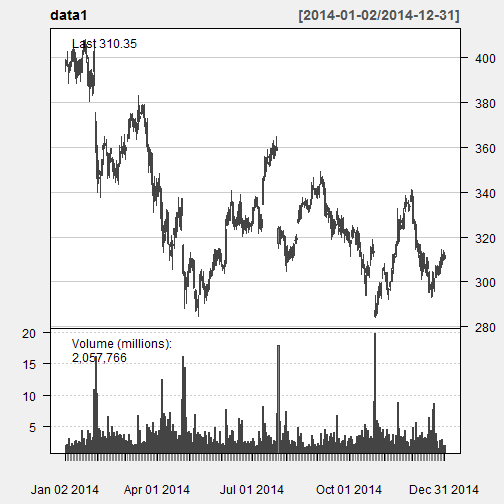
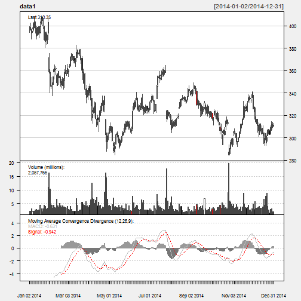
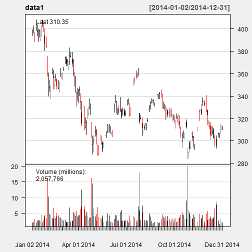
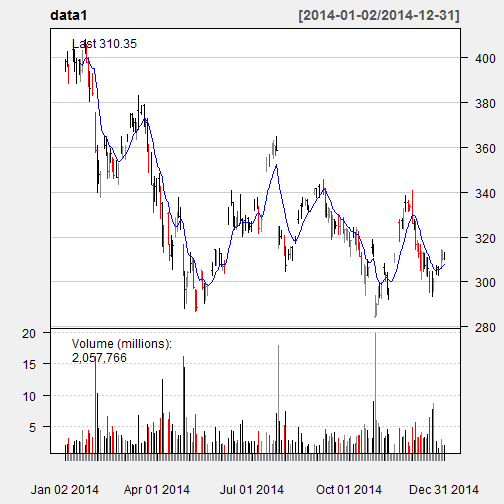

Stock Analysis App
========================================================
author: HP
date: 05/24/2015
Created using Shiny and R Studio

Stock Analysis App - Overview
========================================================

The Stock Analysis Shiny App will collect two pieces of input
and provide twp basic stock analysis chart

The advantages this App provides are
- Basic moving average of a stock ticker symbol
- Basic Analysis of the stock over a period
- One eye chart view of volume and trend of the stock

Stock Analysis App - Inputs
========================================================

The Stock Analysis collect two pieces of information from the user
- A Stock ticker symbol
- A date range to collect stock information

Then the stock information is collected from the Google Finance using
the quantmod R financial package.  The function call used is **getSymbols()**.
For example if user enters AMZN as the ticker symbol, a similiar piece of R
code as below will be executed.


```r
library(quantmod)
getSymbols(c("AMZN"), src = "google")
```

```
[1] "AMZN"
```
Also the stock charts are adjusted interactively.

Stock Analysis Output
========================================================

The Stock Analysis App will output two plots.
- A basic time series chart of the stock ticker symbol 
- A bar chart with Exponential Moving Average (EMA)
In the first chart a Moving Average Convergence and Divergence (MACD) is added.
The MACD is added using *addMACD()* quantmod function.
The EMA is added using *addEMA()* quantmod function

Stock Analysis App - Basic Stock chart
========================================================

The first chart is the basic candle series stock chart.

For example if the ticker symbol is 'AMZN' and we have a date range
for January 1, 2014 to December 31, 2014, a plot like below 
will be presented.

  

Stock Analysis App - Bar chart with EMA
========================================================

The second chart is the basic bar chart and an Exponential 
Moving Average is added to the chart.

For example if the ticker symbol is 'AMZN' and we have a date range
for January 1, 2014 to December 31, 2014, a plot like below 
will be presented.

  
